# YOUTUBE-BACKEND

This is a backend for a YouTube-like application built using tRPC. It provides APIs for user authentication, video management, and other functionalities required for a video-sharing platform.

## Features

- User authentication (sign up, login, logout)
- Video upload and management

## Technologies Used

- tRPC for building type-safe APIs and Context support
- Mongoose(ORM) for database management
- JWT for authentication
- Express.js for handling HTTP requests

## Getting Started

### Prerequisites

- Node.js installed on your machine
- MongoDB installed and running

### Installation

1. Clone the repository:

   ```bash
   git clone https://github.com/Subhojit0012/youtube-backend.git
   ```

2. Navigate to the project directory:

   ```bash
    cd youtube-backend
    ```

3. Install dependencies:(use pnpm package manager)

    ```bash
    pnpm install
    ```

4. Create an .env file in the root directory and add the following environment variables:

   ```env
   MONGODB_URI=your_mongodb_connection_string
   JWT_SECRET=your_jwt_secret_key
   ```

### Running the Application

To start the server, run the following command:

```bash
    pnpm start
```

The server will start on the specified port (default is 5000). You can access the APIs at `http://localhost:5000/api`.

## API Endpoints

### Authentication

- `POST /trpc/signup`: Register a new user
- `POST /trpc/login`: Log in a user
- `POST /trpc/logout`: Log out a user
- `GET /trpc/profile`: Get the authenticated user's information
- `POST /trpc/update`: Update user information
- `POST /trpc/delete`: Delete a user account

### Video Management

- `POST /trpc/upload`: Upload a new video
- `GET /trpc/getVideosById`: Get a video by its ID

### Playlist Management

- `POST /trpc/createPlaylist`: Create a new playlist
- `POST /trpc/addVideoToPlaylist`: Add a video to a playlist

### History Management

- `POST /trpc/addToHistory`: Add a video to the user's watch history
- `GET /trpc/getHistory`: Get the user's watch history

## Current Architecture:

```mermaid
%% Generated by https://gitdiagram.com/subhojit0012/youtube-backend
flowchart TD

subgraph group_entry["HTTP and tRPC"]
  node_server["Express bootstrap<br/>[index.ts]"]
  node_app_router["Router registry<br/>[_app.router.ts]"]
end

subgraph group_identity["Identity and context"]
  node_context["tRPC context and auth<br/>[context.utility.ts]"]
  node_tokens["JWT utilities<br/>[token.utility.ts]"]
end

subgraph group_features["Product workflows"]
  node_user_routes["User routes<br/>[user.route.ts]"]
  node_video_routes["Video routes<br/>[video.route.ts]"]
  node_playlist_routes["Playlist routes<br/>[playlist.route.ts]"]
  node_history_routes["History routes<br/>[history.route.ts]"]
  node_user_service["Account operations<br/>[user.service.ts]"]
  node_video_service["Video operations<br/>[video.service.ts]"]
  node_history_service["Watch history<br/>[history.service.ts]"]
  node_playlist_service["Playlist service"]
end

subgraph group_data["MongoDB persistence"]
  node_mongo_connect["MongoDB connection<br/>[connect.db.ts]"]
  node_user_model[("User model<br/>[user.model.ts]")]
  node_video_model[("Video model<br/>[video.model.ts]")]
  node_playlist_model[("Playlist model<br/>[playlist.model.ts]")]
  node_history_model[("History model<br/>[history.model.ts]")]
  node_channel_model[("Channel model<br/>[channel.model.ts]")]
  node_comment_model[("Comment model<br/>[comment.model.ts]")]
  node_subscribe_model[("Subscription model<br/>[subscribe.model.ts]")]
end

node_client(("API client"))
node_mongodb[("MongoDB")]

node_client -->|"sends requests"| node_server
node_server -->|"mounts tRPC"| node_app_router
node_server -->|"creates context"| node_context
node_server -->|"connects database"| node_mongo_connect
node_app_router -->|"merges routes"| node_user_routes
node_app_router -->|"merges routes"| node_video_routes
node_app_router -->|"merges routes"| node_playlist_routes
node_app_router -->|"merges routes"| node_history_routes
node_context -->|"decodes tokens"| node_tokens
node_user_routes -->|"calls operations"| node_user_service
node_user_routes -->|"reads profile"| node_user_model
node_video_routes -->|"calls operations"| node_video_service
node_playlist_routes -->|"reads and writes"| node_playlist_model
node_history_routes -->|"calls operations"| node_history_service
node_user_service -->|"reads and writes"| node_user_model
node_video_service -->|"reads and writes"| node_video_model
node_history_service -->|"reads and writes"| node_history_model
node_playlist_model -->|"references videos"| node_video_model
node_playlist_model -->|"references owner"| node_user_model
node_user_model -->|"references channel"| node_channel_model
node_user_model -->|"references history"| node_history_model
node_user_model -->|"references playlists"| node_playlist_model
node_user_model -->|"references videos"| node_video_model
node_user_model -->|"references subscriptions"| node_subscribe_model
node_mongo_connect -->|"opens connection"| node_mongodb

click node_server "https://github.com/subhojit0012/youtube-backend/blob/main/src/index.ts"
click node_app_router "https://github.com/subhojit0012/youtube-backend/blob/main/src/router/_app.router.ts"
click node_user_routes "https://github.com/subhojit0012/youtube-backend/blob/main/src/router/user.route.ts"
click node_video_routes "https://github.com/subhojit0012/youtube-backend/blob/main/src/router/video.route.ts"
click node_playlist_routes "https://github.com/subhojit0012/youtube-backend/blob/main/src/router/playlist.route.ts"
click node_history_routes "https://github.com/subhojit0012/youtube-backend/blob/main/src/router/history.route.ts"
click node_context "https://github.com/subhojit0012/youtube-backend/blob/main/src/utility/context.utility.ts"
click node_tokens "https://github.com/subhojit0012/youtube-backend/blob/main/src/utility/token.utility.ts"
click node_user_service "https://github.com/subhojit0012/youtube-backend/blob/main/src/service/user.service.ts"
click node_video_service "https://github.com/subhojit0012/youtube-backend/blob/main/src/service/video.service.ts"
click node_history_service "https://github.com/subhojit0012/youtube-backend/blob/main/src/service/history.service.ts"
click node_playlist_service "https://github.com/subhojit0012/youtube-backend/blob/main/src/service/playlist.service.ts"
click node_mongo_connect "https://github.com/subhojit0012/youtube-backend/blob/main/src/db/connect.db.ts"
click node_user_model "https://github.com/subhojit0012/youtube-backend/blob/main/src/db/models/user.model.ts"
click node_video_model "https://github.com/subhojit0012/youtube-backend/blob/main/src/db/models/video.model.ts"
click node_playlist_model "https://github.com/subhojit0012/youtube-backend/blob/main/src/db/models/playlist.model.ts"
click node_history_model "https://github.com/subhojit0012/youtube-backend/blob/main/src/db/models/history.model.ts"
click node_channel_model "https://github.com/subhojit0012/youtube-backend/blob/main/src/db/models/channel.model.ts"
click node_comment_model "https://github.com/subhojit0012/youtube-backend/blob/main/src/db/models/comment.model.ts"
click node_subscribe_model "https://github.com/subhojit0012/youtube-backend/blob/main/src/db/models/subscribe.model.ts"

classDef toneNeutral fill:#f8fafc,stroke:#334155,stroke-width:1.5px,color:#0f172a
classDef toneBlue fill:#dbeafe,stroke:#2563eb,stroke-width:1.5px,color:#172554
classDef toneAmber fill:#fef3c7,stroke:#d97706,stroke-width:1.5px,color:#78350f
classDef toneMint fill:#dcfce7,stroke:#16a34a,stroke-width:1.5px,color:#14532d
classDef toneRose fill:#ffe4e6,stroke:#e11d48,stroke-width:1.5px,color:#881337
classDef toneIndigo fill:#e0e7ff,stroke:#4f46e5,stroke-width:1.5px,color:#312e81
classDef toneTeal fill:#ccfbf1,stroke:#0f766e,stroke-width:1.5px,color:#134e4a
class node_server,node_app_router,node_client toneBlue
class node_context,node_tokens,node_mongodb toneAmber
class node_user_routes,node_video_routes,node_playlist_routes,node_history_routes,node_user_service,node_video_service,node_history_service,node_playlist_service toneMint
class node_mongo_connect,node_user_model,node_video_model,node_playlist_model,node_history_model,node_channel_model,node_comment_model,node_subscribe_model toneRose
```


## License

This project is licensed under the MIT License - see the [LICENSE](LICENSE) file for details
