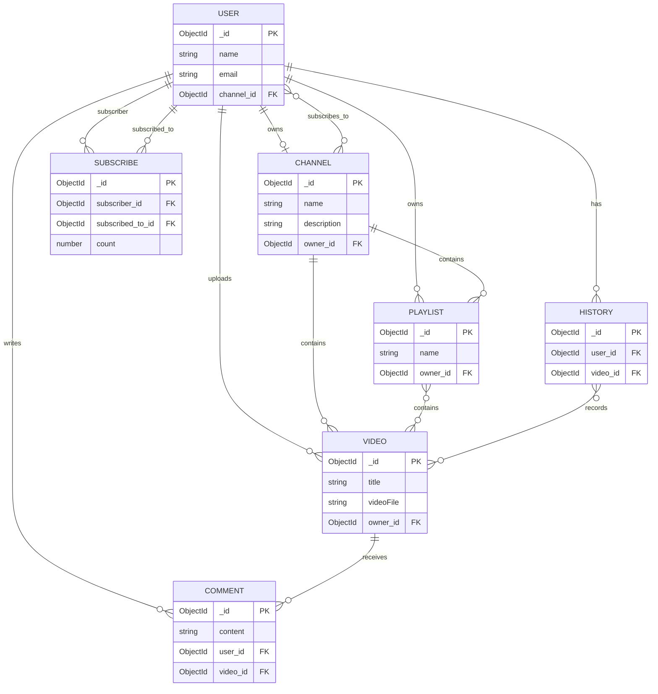

# Model Relationships

This diagram summarizes the conceptual relationships among the Mongoose models in `src/db/models`.

## Notes

- Mongoose `ref` values identify related documents; they are not database-enforced foreign keys. The `FK` labels above are diagram notation only.
- The diagram consolidates paired references into conceptual relationships. For example, `User.channel` and `Channel.owner` describe channel ownership; `Channel.videos` and `Video.owner` describe the channel's videos and their uploader.
- Some schema fields store references as arrays even where the conceptual relationship is singular per document. In particular, `Comment.videoId` and `Comment.userId` are arrays, while the diagram shows each comment as written by one user and attached to one video. `History.videoId` is also an array, represented as a history record containing multiple videos.
- Subscriptions appear in both `Channel.subscribers` and `Subscribe` (which links one user to another). Both representations are shown because they are distinct references in the current schemas.
