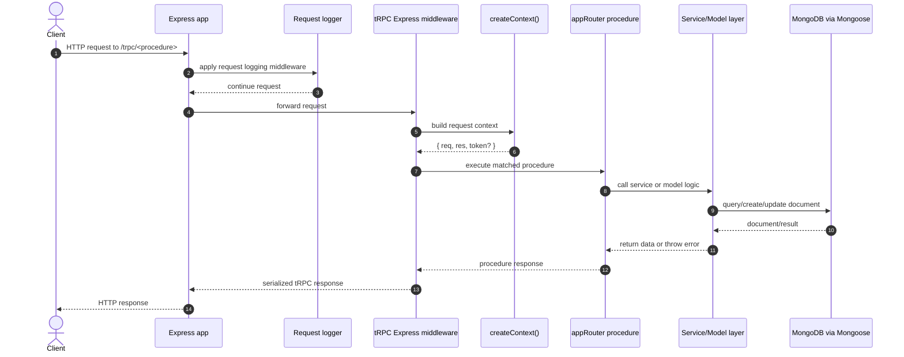
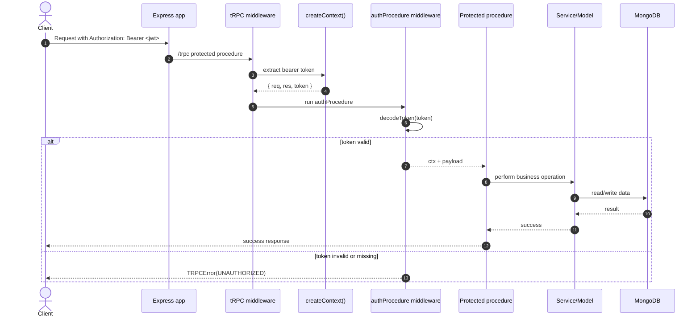
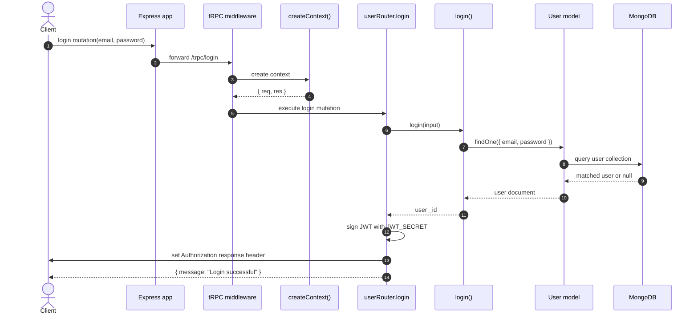
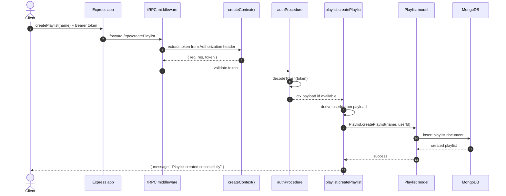
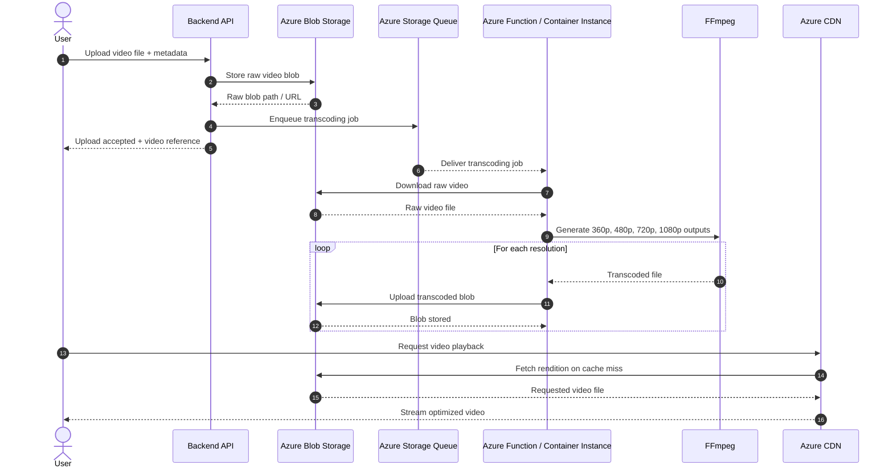

# Request Sequence Diagram

This document explains how requests move through the current `trpc-backend` codebase and gives sequence diagrams for the most important runtime paths.

## Scope

The repository currently exposes a single Express-mounted tRPC entrypoint:

- `/trpc`

Because the root router is assembled with `mergeRouters(...)`, procedures are currently exposed as top-level tRPC procedures such as:

- `signup`
- `login`
- `createPlaylist`
- `addToHistory`

Requests then flow through:

1. Express request logging middleware
2. tRPC Express middleware
3. `createContext` in `src/utility/context.utility.ts`
4. A router procedure in `src/router/*`
5. A service or Mongoose model call
6. MongoDB through Mongoose

## High-Level Request Flow

## Authentication-Aware Flow

The repository uses `authProcedure` for protected procedures such as:

- `deleteUser`
- `update`
- `getUserById`
- `createPlaylist`
- `addVideoToPlayList`
- `addToHistory`

`authProcedure` decodes the bearer token from the `Authorization` header and extends the request context with `payload`.

## Concrete Example: `login`

`login` is the entrypoint that issues the JWT used later by protected procedures.

## Concrete Example: `createPlaylist`

This is a good example of the protected request lifecycle because it uses `authProcedure`, reads the decoded token, and persists data through a model static.

## Azure Video Upload And Transcoding Flow

This sequence reflects the storage architecture described in [video-storage.md](/C:/Users/subho/OneDrive/Desktop/project-models/trpc-backend/docs/video-storage.md): raw uploads go to Azure Blob Storage, a queue triggers asynchronous transcoding, FFmpeg generates multiple renditions, and Azure CDN serves the final assets.

## Router-to-Service Map

The current repository uses these main execution paths:

| Procedure | Protection | Main downstream call |
| --- | --- | --- |
| `signup` | public | `createUser()` |
| `login` | public | `login()` |
| `deleteUser` | authenticated | `deleteUser()` |
| `update` | authenticated | `updateUser()` |
| `getUserById` | authenticated | `User.findById()` |
| `uploadVideo` | public in current code | `createVideoModel()` |
| `getVideoById` | public | `getVideoById()` |
| `createPlaylist` | authenticated | `Playlist.createPlaylist()` |
| `addVideoToPlayList` | authenticated | `Playlist.findOne()` then `playlist.addToPlaylist()` |
| `addToHistory` | authenticated | `historyService()` |

## Notes About The Current Implementation

- `createContext` currently extracts the bearer token but does not decode it directly.
- Token decoding happens inside `authProcedure`.
- Protected routes depend on the client sending `Authorization: Bearer <jwt>`.
- `login` and `signup` currently place the token in the response `Authorization` header.
- `uploadVideo` is not protected right now because it uses `procedure` instead of `authProcedure`.

These details are reflected in the diagrams above so the documentation matches the repository as it exists today.
