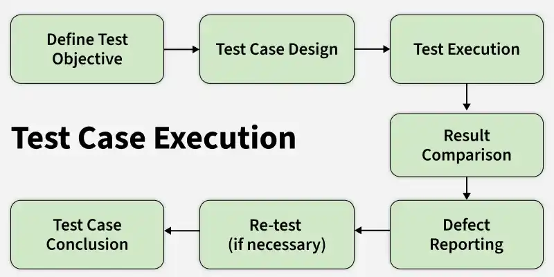

# Video Streaming platform

-- config-project --
-- install required dependency --
-- create a MD file for folder-structure for visualisation --

[] setup environment variable
[] implement a Databse
[] build schema for video, user, comment, like, subscribe, session
[] authentication

## Testing: Services And Routers

### Test foundation

[] replace the database-dependent placeholder in `src/test/user.test.ts` with isolated tests
[] add a `test` script using `tsx` and Node.js built-in test runner
[] use `node:test` for suites, hooks, and mocks
[] use `node:assert/strict` for behavior assertions
[] create reusable valid-input, fake-document, request/response, and JWT fixtures
[] mock Mongoose model methods with `mock.method` and restore mocks after each test
[] keep unit tests independent of MongoDB and Redis

### User service tests

[] test `createUser` required-field validation
[] test duplicate email rejection
[] test successful user creation and returned ID
[] test user creation failure handling
[] test `login` validation, success, and unknown-user behavior
[] test `deleteUser` success and not-found behavior
[] test `updateUser` name-only, password-only, combined, and missing-input branches

### History service tests

[] test first history creation
[] test moving an existing video to the front without duplication
[] test prepending a new video
[] test history document saving
[] test empty and populated history retrieval
[] test invalid video behavior in the history helper

### Video service tests

[] test video creation payload and failure handling
[] test video ID validation and lookup success
[] test lookup of a missing video and database exceptions
[] test the query arguments used by `getAllVideosOfUser`
[] document the current empty `getAllVideos` behavior
[] test video deletion success, missing video, and ownership failure
[] document current deletion error wrapping behavior

### Playlist service tests

[] test playlist creation payload and existing-playlist behavior
[] test missing playlist and wrong-owner errors
[] test successful playlist operations
[] document that `deletePlaylist` is currently not exported

### Router tests

[] test user router Zod validation and authentication failures
[] test signup/login delegation and JWT `Authorization` headers
[] test authenticated user delete, update, and profile procedures
[] test video upload validation, payload ID extraction, delegation, and awaiting behavior
[] test public video lookup validation and response
[] test playlist name/ID validation, authorization, ownership, and successful save
[] test history authentication, `videoId` validation, payload ID extraction, and response shape

### Regression tests

[] document the JWT payload `id` versus `_id` mismatch
[] document the unawaited video upload creation
[] document the `Video.findById({ owner })` query behavior
[] document deletion errors being converted to internal errors
[] document the empty `getAllVideos` implementation

### Verification and future integration tests

[] run focused test files with Node.js built-in test runner
[] run all `src/test/**/*.test.ts` files repeatedly for deterministic results
[] run `tsc --noEmit` after adding tests
[] verify mock cleanup and test isolation
[] add MongoDB-backed integration tests under a separate command
[] cover real persistence, schema behavior, and database indexes in integration tests
